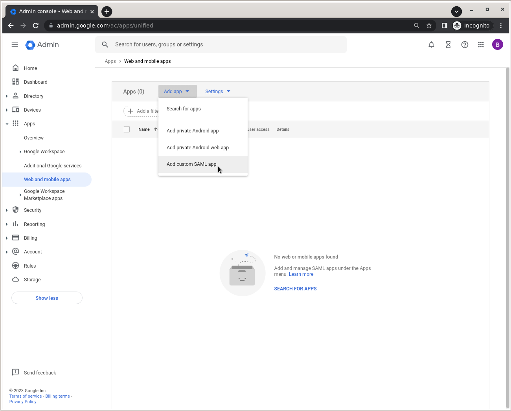
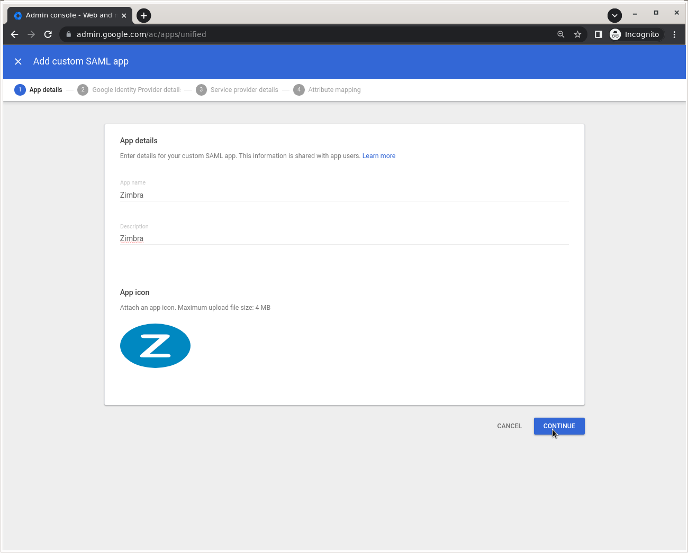
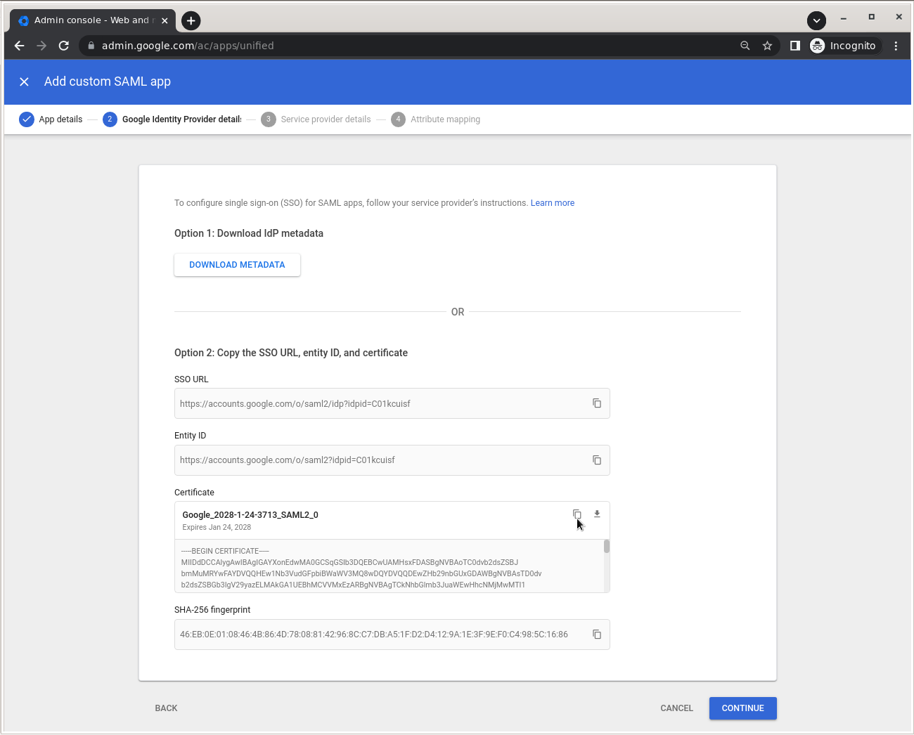
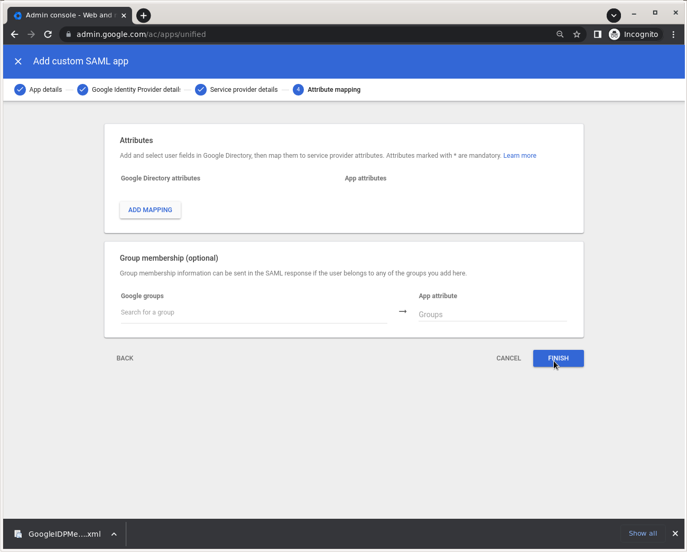
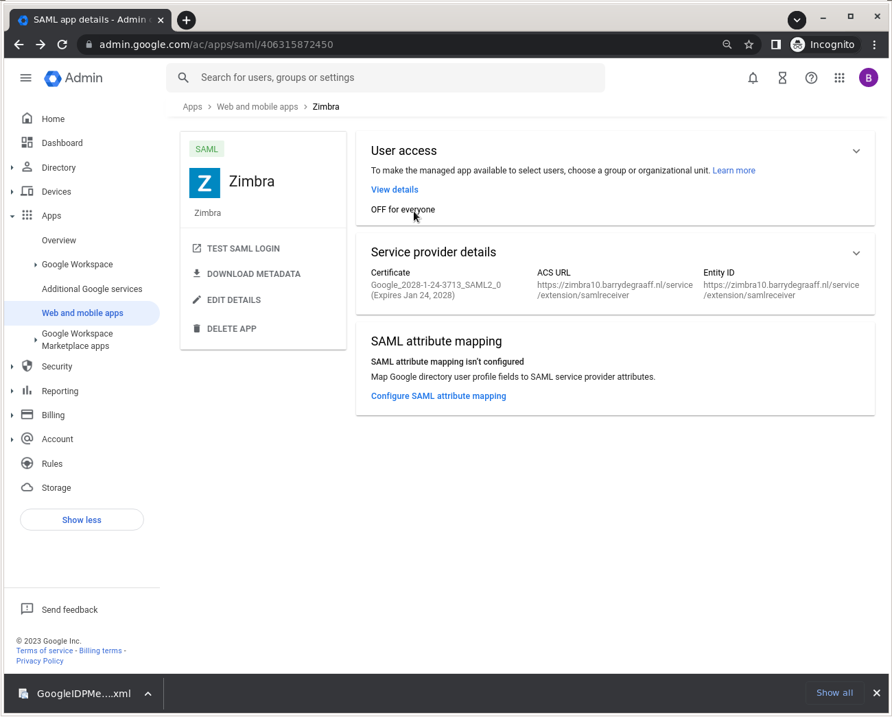
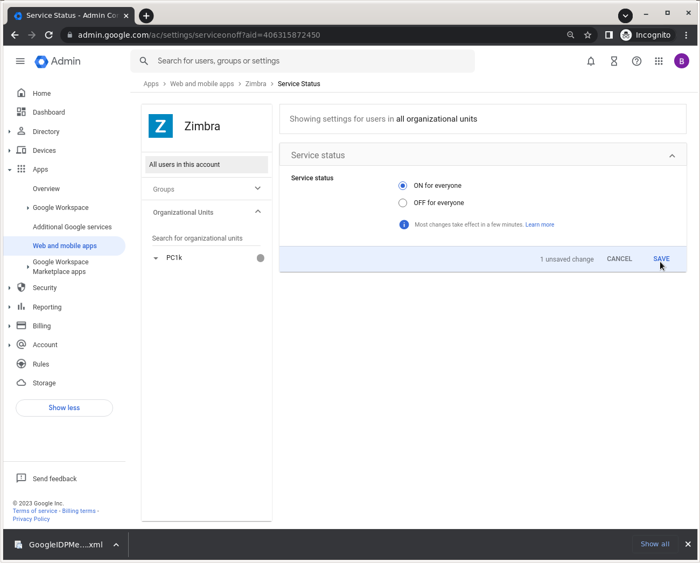

# Zimbra with Single Sign-On using Google Workspaces

In this article you will learn how to set-up Zimbra on Google Workspaces. Google Workspaces serves as a SAML Identity Provider (IdP) and Zimbra will be a SAML Service Provider (SP).

The technology used in this article is SAML, an open standard for Single Sign-On. When using SAML an Identity Provider (IdP) will take care of user authentication after which users can use their applications without having to log-on to each of them separately. In SAML these applications are called Service Providers (SP). 

Learning objectives:

- How-to configure Zimbra as an App in Google Workspaces

## Prerequisites

The domain used in in Google Workspaces must match the domain of the users in Zimbra. So if you sign-on to Google Workspaces using example.com, you will need to have a domain example.com in Zimbra as well. In addition the users in Zimbra are not automatically provisioned. So you have to create an account for each user in both Google Workspaces and in Zimbra.

## Set up Google Workspaces

This article uses the example Zimbra server `zimbra10.barrydegraaff.nl`, don't forget to replace this with your own Zimbra server domain.

1. Go to https://admin.google.com/ and sign in using an account with super administrator privileges .

2. Go to Menu > Apps > Web and mobile apps. 



3. Click Add App > Add custom SAML app.

Then complete the wizard as follows:



Set a name and description for your Zimbra app and upload an icon.



From this screen you need to copy/paste and store the SSO URL value and the Certificate so you can use it to configure Zimbra in one of the following steps. Click Continue.



Click Finish. Mapping and membership are not required.



Allow users to access the App by clicking OFF for everyone.



Select ON for everyone and click SAVE.


### References

- https://support.google.com/a/answer/6087519?hl=en&ref_topic=7559288
- https://support.google.com/a/topic/7556794?hl=en&ref_topic=7556686

## Set up Zimbra

Store the IDP certificate from above in `/tmp/idpcert.pem` the contents should look like:

```
root@zimbra10:~# cat /tmp/idpcert.pem
-----BEGIN CERTIFICATE-----
MIIDdDCCAlygAwIBAgIGAYXonEdwMA0GCSqGSIb3DQEBCwUAMHsxFDASBgNVBAoT
C0dvb2dsZSBJbmMuMRYwFAYDVQQHEw1Nb3VudGFpbiBWaWV3MQ8wDQYDVQQDEwZH
b29nbGUxGDAWBgNVBAsTD0dvb2dsZSBGb3IgV29yazELMAkGA1UEBhMCVVMxEzAR
BgNVBAgTCkNhbGlmb3JuaWEwHhcNMjMwMTI1MTEwNzEzWhcNMjgwMTI0MTEwNzEz
WjB7MRQwEgYDVQQKEwtHb29nbGUgSW5jLjEWMBQGA1UEBxMNTW91bnRhaW4gVmll
dzEPMA0GA1UEAxMGR29vZ2xlMRgwFgYDVQQLEw9Hb29nbGUgRm9yIFdvcmsxCzAJ
BgNVBAYTAlVTMRMwEQYDVQQIEwpDYWxpZm9ybmlhMIIBIjANBgkqhkiG9w0BAQEF
AAOCAQ8AMIIBCgKCAQEAmUcDm3Sg4DkoYDeBW6tEsb/tTTeRPl4Kz3M3cowNfBDy
PSeyCKHocwMQjozFtvTde6FIhpBfT8DUd+4PHvUjn+aPleSWzQgtxgJMLeMrQHmM
hJ3qSprWz4mPejtSEouqmcol3KLzC+/oWcKXDVPL7e8p3L2KZ/rX57TQut0B5bqc
Ze4XgNS+Sz8Qwqg0lToQqfXBUMey0Z8ZamJsP4M6U4b+z/KDLhq3c4uTsMee1khE
IU1iQlzDhncgBP69vgt+LpfuqjgK4/gESdhoAHeaVyDT2bDQvMr0fZLFXs64taqh
4i+rSox5L4U/SeIsw6tWjLMbSJvfPakROvdRLjLcowIDAQABMA0GCSqGSIb3DQEB
CwUAA4IBAQCB+O98rsQr4TyU7tbYjGgJWfsrqkUH1SLIVLsDclJkWwuG1l3izLvY
DnqQMvV5KC0xRFTCTCoxq0bFVISqMsfTK9q720nVTppPVycPP/yhes8jlu6qivXA
Iwfo5YrdEBLFleipBZYkIsJhZGGxAtVc+rjsLE2/hRp+uCmGFDvd70QSGaTfENbX
lFFe6i9OEETzNKipuc9sD7VTiCmnVSUu8TDb8bq5T0G+BNLtKeUO+68diWgSjIbs
oXDV5DdclS29zuuiwz8RoOZOMC/E6mjGbEsteoJLi3PrYHaFal1n88lbBpfXdOGp
s4rz8ECbwyxLL5Rh3TWbvgliRGfmEoOk
-----END CERTIFICATE-----
```

From the command line create the saml folders by running as root:

```
mkdir /opt/zimbra/lib/ext/saml
mkdir /opt/zimbra/conf/saml/
```
Add the file `/opt/zimbra/conf/saml/saml-config.properties` to configure SAML in Zimbra add the contents:

```
# Issuer
saml_sp_entity_id=https://zimbra10.barrydegraaff.nl/service/extension/samlreceiver
# Login receiver for the service provider
saml_acs=https://zimbra10.barrydegraaff.nl/service/extension/samlreceiver
# Name ID format for the IDP to use in the SAMLResponse
saml_name_id_format=urn:oasis:names:tc:SAML:1.1:nameid-format:emailAddress
# Date format for issue instant
saml_date_format_instant=yyyy-MM-dd'T'HH:mm:ss'Z'
# Identity provider login endpoint for redirect method
saml_redirect_login_destination=https://accounts.google.com/o/saml2/idp?idpid=C01kcuisf-REPLACE_THIS_VALUE
# Identity provider login endpoint for POST method
saml_post_login_destination=https://accounts.google.com/o/saml2/idp?idpid=C01kcuisf-REPLACE_THIS_VALUE           
# Identity provider logout endpoint for redirect method
saml_redirect_logout_destination=                                                                  
# Identity provider logout endpoint for POST method
saml_post_logout_destination=                                                                  
# Logout redirect page if we are the landing page logout endpoint
saml_landing_logout_redirect_url=/
# Disable the audience path check
saml_skip_audience_restriction=true
# URL to send the user with error_code, error_msg query params. Default results in HTTP error code pages.
saml_error_redirect_url=
# The SAML logout document encoding, and SAML login receiver parameter encoding.
saml_document_encoding=ASCII
# Set to true to disable the audience path check.
saml_skip_audience_restriction=false
# The redirect location to send the user if their Zimbra account is not active.
saml_inactive_account_redirect_url
# The redirect location to send the user if webclient login for their Zimbra account is disabled.
saml_webclient_disabled_account_redirect_url
```
Make sure to replace the values of `saml_redirect_login_destination` and `saml_post_login_destination` with the URL stored when you created the App in Google Workspaces.


From the command line as user root copy the samlextn.jar and set up the IDP certificate like this:

```
cp /opt/zimbra/extensions-network-extra/saml/samlextn.jar /opt/zimbra/lib/ext/saml/
su zimbra
cat /tmp/idpcert.pem |xargs -0 zmprov md barrydegraaff.nl zimbraMyoneloginSamlSigningCert
# zmprov mcf zimbraCsrfRefererCheckEnabled FALSE
zmprov mcf zimbraCsrfAllowedRefererHosts accounts.google.com
# new since 9.0.0 patch 25 you are required to set zimbraVirtualHostName:
zmprov md barrydegraaff.nl zimbraVirtualHostName zimbra10.barrydegraaff.nl
/opt/zimbra/bin/zmlocalconfig -e zimbra_same_site_cookie=""  #read below section!
zmmailboxdctl restart
```

### SameSite Cookie restriction and SAML

If your IDP and Zimbra are on the same domain in an on-premise deployment. For example zimbra.example.com and saml-idp.example.com you can use SameSite cookie setting Strict:

```
/opt/zimbra/bin/zmlocalconfig -e zimbra_same_site_cookie="Strict"
zmmailboxdctl restart
```

If your IDP is under a different domain in a hosted SaaS IDP deployment. For example zimbra.example.com and saml.authprovider.org you probably have to disable the SameSite cookie setting as follows:

```
/opt/zimbra/bin/zmlocalconfig -e zimbra_same_site_cookie=""
zmmailboxdctl restart
```


### Test SAML Login

Go to https://admin.google.com/ and click the TEST SAML LOGIN button for the App.


Click the TEST SAML LOGIN button. Please note that it can take up to 5 minutes for Google to load any new App configurations, so if you see a Google error, try again a little later.

### Single logout

SLO is not implemented by Google Workspaces.

### Create users

Your user accounts must be manually created in Zimbra and be available in your IDP user database. It is important that the E-mail attribute in your IDP is set exactly the same as the Zimbra account name. Or the user will not be able to log-in. If it does not work run a `tail -f /opt/zimbra/log/*` while doing the authentication request and dig through to log to find out what the issue may be. Keywords to grep for: SAML, Audience and assertion.

### Configurable Properties saml-config.properties

The samlextn.jar uses a property file located at: `${zimbra_home}/conf/saml/saml-config.properties`.

The following properties are supported:

| Key | Description | Default | Optional |
| --- | ----------- | ------- | -------- |
| saml_sp_entity_id | Issuer | | |
| saml_acs | Login receiver for the service provider | | |
| saml_redirect_login_destination | Identity provider login endpoint for redirect method | | |
| saml_redirect_logout_destination | Identity provider logout endpoint for redirect method | | |
| saml_post_login_destination | Identity provider login endpoint for POST method (unused) | | √ |
| saml_post_logout_destination | Identity provider logout endpoint for POST method (unused) | | √ |
| saml_name_id_format | Name ID format for the IDP to use in the SAMLResponse | `urn:oasis:names:tc:SAML:1.1:nameid-format:unspecified` | √ |
| saml_date_format_instant | Date format for issue instant | `yyyy-MM-dd'T'HH:mm:ss'Z'` | √ |
| saml_error_redirect_url | URL to send the user with `error_code`, `error_msg` query params. Default results in HTTP error code pages. | | √ |
| saml_landing_logout_redirect_url | Logout redirect landing page if we are the last logout service. | `/` | √ |
| saml_document_encoding | The SAML logout document encoding, and SAML login receiver parameter encoding. | `ASCII` | √ |
| saml_skip_audience_restriction | Set to true to disable the audience path check. | `false` | √ |
| saml_inactive_account_redirect_url | The redirect location to send the user if their Zimbra account is not active. | `/service/extension/samllogout` | √ |

### Debugging

If you are having issues you can tail the logs on Zimbra while doing a log-in.

On Zimbra:

```
tail -f /opt/zimbra/log/mailbox.log
```
